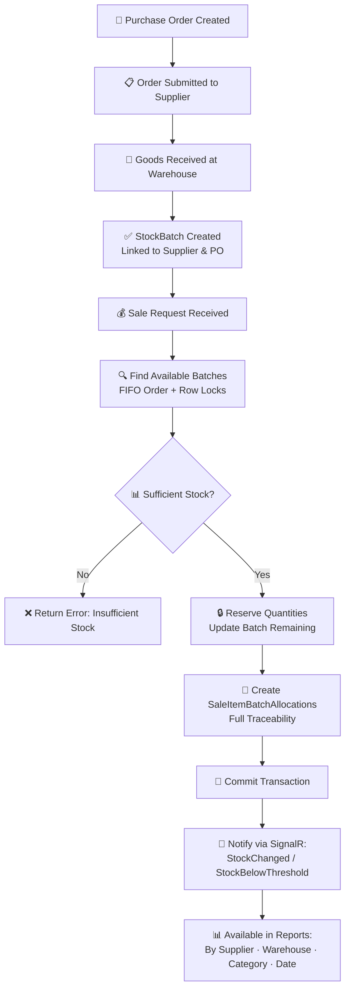

# 📦 InventorySystem – ERP Inventory Module

> A production-quality Inventory Module built with **.NET 8**, **Clean Architecture**, and **SQL Server**.  
> Solves 5 real-world warehouse management challenges with full traceability, concurrency safety, and real-time visibility.


---

## 📑 Table of Contents

1. [Project Structure](#-project-structure)
2. [Business Problems & Solutions](#-business-problems--solutions)
3. [Architectural Decisions](#-architectural-decisions)
4. [Assumptions](#-assumptions)
5. [How to Run](#-how-to-run)
6. [Testing Strategy](#-testing-strategy)
7. [API Documentation](#-api-documentation)
8. [Database Indexes](#-database-indexes)
9. [Purchase Order Lifecycle](#-purchase-order-lifecycle)
10. [Sales Lifecycle Flowchart](#-sales-lifecycle-flowchart)
11. [Next Steps (Roadmap)](#-next-steps-roadmap)

---

## 🗂 Project Structure

```
📦 InventorySystem/
├── 📁 src/
│   ├── 📁 InventorySystem.Domain/           # Entities, Enums, Exceptions, Domain Interfaces
│   ├── 📁 InventorySystem.Application/      # DTOs, Business Interfaces, Use-Case Contracts
│   ├── 📁 InventorySystem.Infrastructure/   # EF Core, Services, Seed Data, SignalR Hub
│   └── 📁 InventorySystem.Api/              # Controllers, Middleware, Program.cs
└── 📁 tests/
    ├── 📁 InventorySystem.Tests.Unit/        # Unit tests for domain logic
    └── 📁 InventorySystem.Tests.Integration/ # Full scenario tests for Problems 1–5
```

---

## 🎯 Business Problems & Solutions

### Problem 1: Tracking the Source of Sales 🔍

**Business Need:** The same product is purchased from different suppliers at different times and prices. When a sale is made, the system must know which specific purchase and supplier each sold unit came from.

**Approach & Solution:**

- Designed a `StockBatch` entity that links every received quantity to a specific `Supplier`, `PurchaseOrderItem`, `Warehouse`, and `Product`.
- When a sale is created, the system allocates quantities from available batches using **FIFO** (First-In, First-Out) — oldest batches are consumed first.
- Every unit sold is traced back to its origin via `SaleItemBatchAllocation`, creating full traceability.
- The `ReportingService` enables queries like *"How much of Product X did we sell from Supplier Y?"* or *"What stock remains from the March shipment?"*

**Key entities:** `StockBatch`, `SaleItemBatchAllocation`, `SaleItem`

**Traceability Flow:**
```
PurchaseOrder → StockBatch (linked to Supplier + PurchaseOrderItem)
                    ↓
            Sale → SaleItem → SaleItemBatchAllocation (FIFO)
                                        ↓
                              Reports: by Supplier / Shipment / Date
```

**Validated by:** Integration tests covering full FIFO scenarios, partial receipts, and performance benchmarks (< 500ms with 50 batches and 100 sales).

---

### Problem 2: Concurrent Sales & Stock Accuracy ⚡

**Business Need:** Multiple staff members sell simultaneously. The system was producing negative stock because two users could read the same available quantity before either committed their sale.

**Approach & Solution:**

| Mechanism | Purpose |
|-----------|---------|
| `IsolationLevel.Serializable` | Prevents phantom reads — no two transactions read the same batch rows simultaneously |
| `ROWLOCK + UPDLOCK` hints | Row-level locks on `StockBatch` fetch queries prevent race conditions between different users |
| `IdempotencyKey` on `CreateSaleRequest` | Prevents double-submit from the same user (e.g., network retry) |
| `RowVersion` on `StockBatch` | Detects conflicting concurrent updates at commit time |
| `ExecutionStrategy` | Automatically retries transient failures (e.g., deadlocks) |

**Key design decision:** Row-level locking at the database level was chosen over application-level locking because it works correctly even with multiple API instances (horizontal scaling).

**Validated by:** Integration test `Concurrency_RaceCondition_ShouldPreventNegativeStock` — simulates two parallel sale requests competing for the last available units and asserts that stock never goes negative.

---

### Problem 3: Stock Transfers Between Warehouses 🔄

**Business Need:** Manual transfers were leaving warehouses in inconsistent states — source warehouse recorded stock as "sent" while the destination never recorded it as "received."

**Approach & Solution:**

- The entire transfer (deduct from source + add to destination) runs inside a **single Atomic Transaction** (`IsolationLevel.Serializable`).
- If any step fails, a full `ROLLBACK` occurs — no partial state is ever persisted.
- `IdempotencyKey` prevents duplicate transfer requests (e.g., from network retries).
- A new `StockBatch` is created in the destination warehouse, preserving the original `SupplierId` and `PurchaseDate` for full traceability.
- Notifications are dispatched on both success and failure.

**What if the network drops mid-operation?**  
Since the transfer is a single database transaction, a network interruption before `COMMIT` will result in an automatic `ROLLBACK`. The `IdempotencyKey` ensures a retry of the same request won't create a duplicate.

**What about the `StockTransferStatus` enum?**  
The enum (`Pending → InTransit → Received → Cancelled → Failed`) exists as infrastructure for future multi-step workflows. The current implementation executes transfers atomically in a single step, which satisfies the current business requirements. The enum is ready to be activated when a multi-stage approval workflow is needed.

**Validated by:** Concurrency tests asserting no negative stock and consistency across both warehouses after parallel transfer attempts.

---

### Problem 4: Real-Time Visibility 🔔

**Business Need:** Managers want to see stock changes as they happen, and be alerted when stock falls below a threshold — without refreshing the page.

**Approach & Solution:**

- Implemented a **SignalR Hub** (`InventoryHub`) that pushes two types of events:
  - `StockChanged` — fired after every purchase, sale, or transfer that modifies stock.
  - `StockBelowThreshold` — fired when remaining quantity drops below the configured threshold (currently 5 units).
- The `INotificationService` interface decouples the notification logic from the transport layer. The current implementation uses SignalR, but it can be swapped for Email, SMS, or a message broker without touching business logic (Open/Closed Principle).

**Validated by:** Integration tests using `FakeNotificationService` to verify that notification methods are called correctly after stock-modifying operations.

---

### Problem 5: Reporting with Performance 📊

**Business Need:** A reporting endpoint with filters for warehouse, supplier, product category, and date range — that remains fast even as the database grows.

**Approach & Solution:**

- `ReportingService` builds **dynamic LINQ queries** — filters are applied only when provided, avoiding unnecessary query overhead.
- `AsNoTracking()` is used for all read-only queries to reduce EF Core overhead.
- Strategic **database indexes** were added on the most frequently filtered columns (see [Database Indexes](#-database-indexes) section below).

**Validated by:** Integration tests confirming filter correctness (by supplier, by date range, by category, by warehouse) and a performance test asserting report execution under 500ms with realistic data volumes.

---

## 🏗 Architectural Decisions

### Clean Architecture Layers

```
┌──────────────────────────────────────────────┐
│                 API Layer                    │  Controllers, Middleware, Swagger
├──────────────────────────────────────────────┤
│              Application Layer               │  DTOs, Interfaces, Use-Case Contracts
├──────────────────────────────────────────────┤
│                Domain Layer                  │  Entities, Enums, Exceptions (no dependencies)
├──────────────────────────────────────────────┤
│            Infrastructure Layer              │  EF Core, Services, SignalR, Seed Data
├──────────────────────────────────────────────┤
│              Shared Kernel Layer             │  Shared utilities, BaseResponse<T>, Enums,
│                                              │  cross-cutting concerns used by all layers
│              (InventorySystem.Shared)        │
├──────────────────────────────────────────────┤
│                Test Layers                   │  Unit Tests + Integration Tests
│                                              │  (InventorySystem.Tests)
└──────────────────────────────────────────────┘

```

### SOLID Principles Applied

| Principle | Implementation |
|-----------|---------------|
| **SRP** | Each service owns one responsibility: `PurchaseService`, `SalesService`, `StockTransferService`, `ReportingService` |
| **OCP** | `INotificationService` allows adding new notification channels (Email, SMS) without modifying existing code |
| **LSP** | All services implement their interfaces without breaking expected behavior |
| **ISP** | Specialized interfaces: `IPurchaseService`, `ISalesService`, etc. — no bloated "god" interfaces |
| **DIP** | Controllers and services depend on abstractions (interfaces), not concrete implementations |

### Key Design Patterns

| Pattern | Where Used | Benefit |
|---------|-----------|---------|
| **Repository / Service Layer** | All domain services | Separates data access from business logic; improves testability |
| **Idempotency Key** | Sales, Transfers | Prevents duplicate operations in unreliable network conditions |
| **Observer (via SignalR)** | NotificationService | Decoupled real-time broadcasting without tight coupling to consumers |
| **Strategy (FIFO)** | Batch allocation in SalesService | Accurate cost accounting; easy to extend with LIFO or weighted-average |

### Data Layer Choices

- **Soft Delete** — All major entities include `IsActive` and `DeletedAt` to preserve audit history.
- **Audit Fields** — `CreatedBy`, `CreatedAt`, `ModifiedBy`, `ModifiedAt` on every mutable entity.
- **Concurrency Token** — `RowVersion` on `StockBatch` detects conflicting concurrent updates.
- **Manual Schema Design** — The database schema was designed from scratch to match the domain model, not auto-generated from code.

---

## 📌 Assumptions

> These assumptions were made based on interpreting the business requirements. They are explicitly documented so they can be revisited during the technical discussion.

| # | Assumption | Reasoning |
|---|-----------|-----------|
| 1 | All stock-modifying operations must be **atomic** | Any partial failure must leave the system in its original state — no "half-sold" or "half-transferred" stock |
| 2 | Sales are allocated using **FIFO** | Oldest batches are consumed first — standard practice for perishable and cost-tracking purposes |
| 3 | **No returns** are supported in this version | Returns would require reversing batch allocations — a meaningful feature with its own complexity, flagged as a roadmap item |
| 4 | Transfers are **direct and immediate** | No multi-step approval workflow — but `StockTransferStatus` enum is ready for future expansion |
| 5 | Low-stock threshold is **5 units** (fixed) | Hardcoded for simplicity; can be made per-product/per-warehouse configurable without architectural changes |
| 6 | **No authentication/authorization** in this version | The architecture supports adding ASP.NET Core Identity + JWT without structural changes |
| 7 | **Partial receipt** is supported | Suppliers often deliver in multiple shipments; each delivery creates an independent `StockBatch` |

---

## 🚀 How to Run

### Prerequisites

- [.NET 8 SDK](https://dotnet.microsoft.com/download)
- SQL Server 2019+ **or** Docker Desktop

---

### Option 1: Local Development

```bash
# 1. Clone the repository
git clone https://github.com/BahaaEbraheem/InventorySystem.git
cd InventorySystem

# 2. Apply database migrations
dotnet ef database update --project src/InventorySystem.Infrastructure \
                           --startup-project src/InventorySystem.Api

# 3. Run the API
dotnet run --project src/InventorySystem.Api
```

The API will be available at: `https://localhost:5001`  
Swagger UI: `https://localhost:5001/swagger`

---

### Option 2: Docker (Recommended)

```bash
# Build and start all services (API + SQL Server)
docker-compose up --build

# The API will be available at http://localhost:5000
# Swagger UI: http://localhost:5000/swagger
```

---

### 🌱 Seed Data

On first run, `DbSeeder` automatically creates:

| Entity | Data |
|--------|------|
| Warehouses | Main Warehouse (Riyadh), Branch Warehouse (Jeddah) |
| Suppliers | Al-Nour Trading, Golden Supplier |
| Categories | Electronics, Food |
| Products | Laptop 15", Chocolate 500g |
| Purchase Order | 1 fully-received order with a ready `StockBatch` |

This ensures the project runs **out of the box** — no manual setup required.

---

## 🧪 Testing Strategy

### Integration Tests (Problems 1–5)

| Test Class | Problem | Key Scenario |
|-----------|---------|-------------|
| `Problem1_TraceabilityIntegrationTests` | #1 Source Tracking | Buy from 2 suppliers → sell via FIFO → verify per-supplier report |
| `Problem2_ConcurrencyIntegrationTests` | #2 Concurrent Sales | 2 parallel sale requests on same stock → assert no negative stock |
| `Problem3_StockTransferIntegrationTests` | #3 Transfers | Concurrent transfers → assert source and destination consistency |
| `Problem4_NotificationIntegrationTests` | #4 Real-Time | Sale/transfer completes → assert notification methods called |
| `Problem5_ReportingIntegrationTests` | #5 Reporting | Multi-filter queries + performance benchmark < 500ms |

### Running Tests

```bash
# Run all tests
dotnet test

# Run only integration tests
dotnet test tests/InventorySystem.Tests.Integration

# Run only unit tests
dotnet test tests/InventorySystem.Tests.Unit

# Run with detailed output
dotnet test --logger "console;verbosity=detailed"
```

### Key Assertions (Examples)

```csharp
// Problem 2: No negative stock under concurrent load
Assert.True(remainingStock >= 0, "Stock should never go negative");

// Problem 1: FIFO allocation correctness
Assert.Equal(supplierAId, firstAllocation.StockBatch.SupplierId);

// Problem 5: Performance benchmark
Assert.True(elapsed.TotalMilliseconds < 500, $"Report took {elapsed.TotalMilliseconds}ms");

// Problem 3: Transfer consistency
Assert.Equal(0, sourceWarehouseStock);
Assert.Equal(transferredQty, destinationWarehouseStock);
```
---
## ✨ 📁 Postman Collection – Full End-to-End Scenarios

تم إنشاء ملف Postman Collection شامل باسم:

### **`InventorySystem Full Scenarios.postman_collection.json`**

وهو يغطي جميع السيناريوهات المطلوبة في المهمة من البداية للنهاية، ويعمل مباشرة دون أي إعداد إضافي بفضل بيانات الـ **Seed** التي يتم إنشاؤها تلقائيًا عند تشغيل المشروع لأول مرة.

يُستخدم هذا الـ Collection لاختبار النظام كاملًا (End-to-End) والتحقق من صحة كل التدفقات الأساسية: الشراء، الاستلام، البيع، التحويل، والتقارير.

---

### 🎯 ما الذي يغطيه الـ Collection؟

الملف يحتوي على مجموعات منظمة وجاهزة للتنفيذ:

---

### **1) Get Seed Data**

- Get Products  
- Get Warehouses  
- Get Suppliers  
- Get StockBatches  

> تُستخدم هذه المجموعة للحصول على الـ IDs تلقائيًا من بيانات الـ Seeder، مما يجعل بقية السيناريوهات تعمل دون أي إدخال يدوي.

---

### **2) Purchase Scenarios**

- Create Purchase Order  
- Submit Purchase Order  
- Receive Purchase Order (Full / Partial)  
- Cancel Purchase Order  

> جميع الاستجابات تعمل بنجاح وتعيد `BaseResponse<T>` موحدًا، مع تتبع كامل لحالات الطلب.

---

### **3) Sales Scenarios**

- Sale 10 units (FIFO)  
- Sale 100 units (Insufficient Stock)  
- Get Sale By Id (مع Batch Allocations كاملة)  

> تم اختبار كل السيناريوهات بنجاح، بما في ذلك حالات التزامن (Concurrency) لضمان عدم حدوث Negative Stock.

---

### **4) Stock Transfer Scenarios**

- Transfer 20 units (Main → Branch)  
- Get Transfer By Id  

> الاستجابة تتضمن تفاصيل الدُفعات الجديدة في المستودع الوجهة، مع الحفاظ على **SupplierId** و **PurchaseDate** لضمان التتبع الكامل.

---

### **5) Reports**

- Sales by Supplier  
- Remaining Stock from Shipment  

> جميع التقارير تعمل وتعيد نتائج صحيحة مع الأداء المطلوب (< 500ms)، وتستخدم الفلاتر الديناميكية حسب الحاجة.

---

## 🧪 نجاح جميع Responses

تم اختبار كل الطلبات داخل الـ Collection، وجميعها أعادت الاستجابات المتوقعة:

- **200 OK**  
- **201 Created**  
- **400 Bad Request** (عند الإدخال الخاطئ)  
- **409 Conflict** (عند التزامن أو Idempotency)  
- **404 Not Found** (عند طلب بيانات غير موجودة)  

وكلها تعمل ضمن الهيكل الموحد:

```json
BaseResponse<T>
{
  "success": true/false,
  "code": "SUCCESS / VALIDATION_ERROR / CONFLICT / NOT_FOUND",
  "message": "Readable message",
  "data": { ... },
  "errors": [ ... ],
  "meta": {
    "traceId": "...",
    "timestamp": "...",
    "environment": "...",
    "version": "1.0.0"
  }
}


---

## 📖 API Documentation

### Swagger UI

After starting the project, open:
```
https://localhost:5001/swagger
```

All endpoints include request/response examples and XML documentation.

---

### 🛒 Purchases — `/api/purchases`

| Method | Endpoint | Description | Key Response Codes |
|--------|---------|-------------|-------------------|
| `POST` | `/api/purchases` | Create a new purchase order | `201 Created` |
| `GET` | `/api/purchases/{id}` | Get purchase order details | `200 OK`, `404 Not Found` |
| `POST` | `/api/purchases/{id}/submit` | Submit order to supplier | `200 OK`, `409 Conflict` |
| `POST` | `/api/purchases/{id}/receive` | Record goods receipt (partial or full) | `200 OK`, `400 Bad Request` |
| `POST` | `/api/purchases/{id}/cancel` | Cancel order (Draft or Submitted only) | `200 OK`, `400 Bad Request` |

---

### 💰 Sales — `/api/sales`

| Method | Endpoint | Description | Key Response Codes |
|--------|---------|-------------|-------------------|
| `POST` | `/api/sales` | Create a sale (auto-allocates batches via FIFO) | `201 Created`, `409 Conflict` |
| `GET` | `/api/sales/{id}` | Get sale details with batch allocations | `200 OK`, `404 Not Found` |

**Example: Create Sale**
```json
POST /api/sales
{
  "warehouseId": "3fa85f64-5717-4562-b3fc-2c963f66afa6",
  "idempotencyKey": "unique-client-generated-key",
  "items": [
    {
      "productId": "7cb12d44-1234-4562-b3fc-2c963f66afa6",
      "quantity": 10
    }
  ]
}
```

---

### 🔄 Stock Transfers — `/api/transfers`

| Method | Endpoint | Description | Key Response Codes |
|--------|---------|-------------|-------------------|
| `POST` | `/api/transfers` | Transfer stock between warehouses (atomic) | `201 Created`, `400 Bad Request` |
| `GET` | `/api/transfers/{id}` | Get transfer details | `200 OK`, `404 Not Found` |

---

### 📊 Reports — `/api/reports`

| Method | Endpoint | Query Parameters | Description |
|--------|---------|-----------------|-------------|
| `GET` | `/api/reports/sales` | `warehouseId`, `supplierId`, `productCategoryId`, `fromDate`, `toDate` | Filtered sales report |

**Example:**
```
GET /api/reports/sales?supplierId=abc123&fromDate=2024-01-01&toDate=2024-03-31
```

---

## 📊 Database Indexes

| Table | Column(s) | Index Type | Justification |
|-------|-----------|-----------|--------------|
| `StockBatches` | `SupplierId` | Non-Clustered | Accelerates per-supplier sales reports (Problems 1 & 5) |
| `StockBatches` | `WarehouseId` | Non-Clustered | Speeds up stock queries and transfer operations (Problem 3) |
| `StockBatches` | `ProductId`, `WarehouseId`, `QuantityRemaining` | Composite | Supports fast availability checks + FIFO batch selection (Problem 2) |
| `SaleItemBatchAllocations` | `StockBatchId` | Non-Clustered | Enables fast traceability lookups from sale back to source batch (Problem 1) |
| `Sales` | `SaleDate` | Non-Clustered | Efficient date-range filtering in reports (Problem 5) |
| `Products` | `CategoryId`, `IsActive` | Composite | Speeds up category-filtered reporting queries (Problem 5) |

> **Design note:** All indexes were added after analyzing the actual query patterns from reporting and concurrency-critical operations. Each index was weighed against the write-overhead tradeoff — reads heavily outweigh writes in this domain.

---

## 🔄 Purchase Order Lifecycle

```
┌─────────────┐   submit()   ┌───────────────┐  receive() (partial)  ┌──────────────────────┐
│    Draft    │ ──────────▶  │   Submitted   │ ───────────────────▶  │  PartiallyReceived   │
└─────────────┘              └───────────────┘                       └──────────────────────┘
       │                            │                                          │
       │ cancel()                   │ cancel()                                 │ receive() (complete)
       ▼                            ▼                                          ▼
┌─────────────┐              ┌───────────────┐                       ┌──────────────────────┐
│  Cancelled  │              │   Cancelled   │                       │       Received       │
└─────────────┘              └───────────────┘                       └──────────────────────┘
```

| Stage | Status | Key Action | Who |
|-------|--------|-----------|-----|
| 1 | `Draft` | Create order, add items, set supplier & warehouse | Procurement staff |
| 2 | `Submitted` | Lock order, notify supplier | Procurement manager |
| 3 | `PartiallyReceived` | Record partial delivery → creates `StockBatch` | Warehouse staff |
| 4 | `Received` | All items received → auto-closed by system | System (automatic) |
| ↩ | `Cancelled` | Cancel from `Draft` or `Submitted` only | Manager |

---

## 🔄 Sales Lifecycle Flowchart



> If the diagram does not render, open this file in GitHub or paste it into [Mermaid Live Editor](https://mermaid.live).


---

### ▶️ How to Run Tests Locally

```bash
# Run all tests
dotnet test

# Run only integration tests
dotnet test tests/InventorySystem.Tests.Integration

# Run only unit tests
dotnet test tests/InventorySystem.Tests.Unit

# Run with detailed output
dotnet test --logger "console;verbosity=detailed"


---

## ✅ Next Steps (Roadmap)

| Priority | Feature | Description |
|---------|---------|-------------|
| 🔴 High | **Returns Management** | `ReturnOrder` entity that reverses batch allocations and restores stock |
| 🔴 High | **Authentication & Authorization** | ASP.NET Core Identity + JWT with role-based access control |
| 🟡 Medium | **Configurable Low-Stock Threshold** | Per-product/per-warehouse threshold settings instead of a global constant |
| 🟡 Medium | **Transfer Workflow** | Activate `StockTransferStatus` enum for multi-step: `Requested → Approved → InTransit → Received` |
| 🟢 Low | **Export Reports** | Excel/PDF export of sales and inventory reports |
| 🟢 Low | **Dashboard UI** | Blazor or React frontend with real-time SignalR charts |

---

## 🤝 Contributing

```bash
# 1. Fork the repository
# 2. Create your feature branch
git checkout -b feature/YourFeatureName

# 3. Commit your changes
git commit -m 'feat: add YourFeatureName'

# 4. Push and open a Pull Request
git push origin feature/YourFeatureName
```

**Development Guidelines:**
- Follow Clean Architecture — new features belong in the correct layer.
- Write an integration test for any new business logic.
- Document any new assumptions in this README.
- Use `BaseResponse<T>` for all API responses to maintain consistency.

---

## 📜 License

This project is licensed under the **MIT License** — free to use, modify, and distribute with attribution.

---

<div align="center">

✨ **Developed by [Bahaa Ebraheem](https://github.com/BahaaEbraheem)**

📅 Last Updated: May 2025

🎯 *Solving real inventory problems with scalable, maintainable solutions*

🚀 **Ready to run — just `dotnet run` and explore the Swagger UI!**

</div>
